# Graph Theory

## Eulerian Path and Eulerian Circuit

### Eulerian Path

A _Eulerian Path_ (or Eulerian Trail) is a path of edges that visits all the edges in the graph exactly once.

### Eulerian Circuit

A _Eulerian Circuit_ (or Eulerian Cycle) is actually a Eulerian Path which starts and ends on the same vertex.

### NOTE

It is important to find out the correct starting vertex for this otherwise choosing the wrong starting vertex can lead to having unreachable edges.

### Methods to detect whether a graph contains a Eulerian Circuit or a Eulerian Path

This depends on what kind of graph we're dealing with. Altogether, there are four flavors of the Euler path/circuit problem we care about:

#### Detecting a Eulerian Circuit

| Undirected Graph                 | Directed Graph                                    |
| -------------------------------- | ------------------------------------------------- |
| Every vertex has an even degree. | Every vertex has an equal indegree and outdegree. |

#### Detecting a Eulerian Path

| Undirected Graph                                                             | Directed Graph                                                                                                                                                    |
| ---------------------------------------------------------------------------- | ----------------------------------------------------------------------------------------------------------------------------------------------------------------- |
| Either every vertex has even degree or exactly two vertices have odd degree. | At most one vertex has `outdegree` - `indegree` = 1 and at most one vertex has `indegree` - `outdegree` = 1 and all other vertices have equal in and out degrees. |

## Bipartite Graph

A _bipartite graph_ is one whose vertices can be split into two independent groups U, V such that every edge connects between U and V.

Other definitions exists such as:

- two colorable graph
- there is no cycle with an odd length.

### Maximum Cardinality Matching

Generally we're interested in what's called a **Maximum Cardinality Bipartite Matching (MCBM)**. This is when we've maximized the pairs that can be matched with each other.

There exists several applications such as matching candidates to jobs, chairs to desks, suffers to surf boards, etc..

### Common Matching Variations

#### Bipartite Graph with Unweighted Edges (Easiest)

- Max flow algorithms
- Repeated augmenting paths with DFS
- A more optimized _Hopcroft-Karp_ algorithm.

#### Bipartite Graph with Weighted Edges

- Min Cost Max Flow algorithms
- Hungarian Algorithm (Perfect Matching)
- A more sophisticated Network Simplex which uses Linear Programming (LP).

#### Non-Bipartite Graph with Unweighted Edges

- Edmond's Blossom Algorithm

#### Non-Bipartite Graph with Weighted Edges (Hardest)

- DP Solution for small graphs.

### Max Flow | Ford Fulkerson Algorithm

Finding a flow begins by having what's called a Flow-Graph.

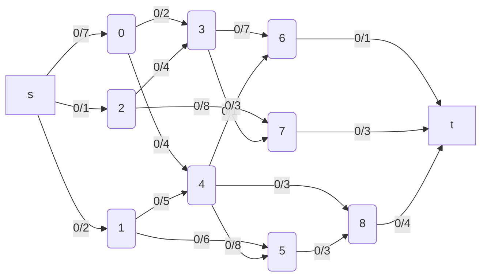

A **Flow Graph** (flow network) is a directed graph where each edge (also called an arc) has a certain _capactity_ which can receive a certain amount of _flow_. At all times, the flow running through an edge must be less than or equal to the capacity.

Edges also have a flow value which means how many units of flow are passing through that edge. Initially the flow is zero for all edges everywhere until we run a Max-Flow algorithm.

There are also 2 special types of nodes in a Flow-Graph:

- Source Node (s)
- Sink node (t)

Now, the Max-Flow problem asks the following:

> Q. With an infinite input source, how much "flow" can we push through the network given that each has a certain capacity ?

Max-Flow can be used in numerous situations. Suppose the edges are roads with cars, pipes with water or wires with electric curtrent. Flow represents the volume of water allowed to flow through the pipes, the number of cars the roads can sustain in traffic and net electric current. Effectively, it's the "bottleneck" value for the amount of flow that can pass through the network from source to sink under all the constraints.

In the flow graph above, the max flow is 7, since 1+2+4 = 7. This is the sum of the flows entering the sink node. That's the maximum value we can push through the network.

> Running a Max-Flow algorithm will determine how much flow each edge should receive to achieve the overall maximum flow.

**NOTE**:
There might be multiple ways of achieving the maximum flow by giving each edge maximum flow value but overall, all solutions will have the same maximum flow value.

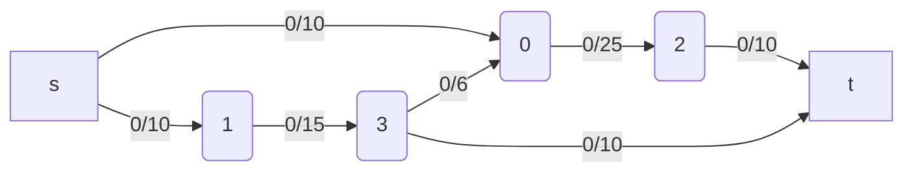

To find the maximum flow (and min-cut as a by-product), the Ford-Fulkerson method repeatedly finds _augmenting paths_ through the **residual graph** and **augments the flow** until no more augmenting paths can be found.

- An _augmenting path_ is a path of edges in the residual graph with unused capacity greater than zero from the source `s` to the sink `t`. In the above graph, the augmenting path is:

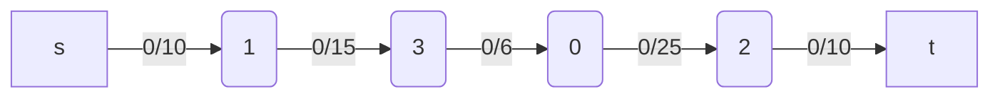

- In the augmenting path above, the _bottleneck_ is the smallest edge on the path. We can use the bottleneck value to **augment the flow** along the path.

- We can find the value of the bottleneck by taking the difference between the capacity and the current flow of an edge:

```php
min(10-0, 15-0, 6-0, 25-0, 10-0) = min(10,15,6,25,10) = 6
```

- _Augmenting the flow_ means updating the flow values of the edges along the augmenting path.
  - For forward edges, this means increasing the flow by the bottleneck value.
  - For backward edges, this means decreasing the flow, along each _residual edge_, by the bottleneck value.

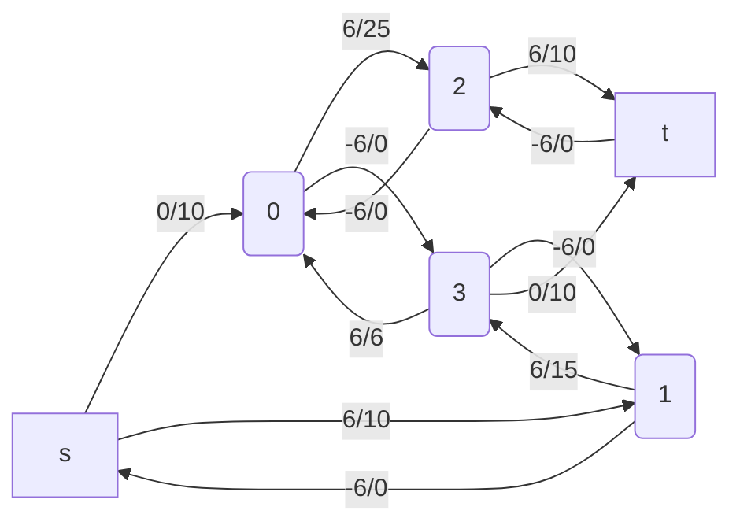

- The logic behind adding _residual edges_ is to "undo" bad choices of augmenting paths which do not lead to a maximum flow.

> Strictly speaking, we don't know which ones are the best or even correct augmenting paths to take. So the logic of _residual edges_ enables us to really find any augmenting paths without having to worry about whether or not we will be able to achieve the maximum flow. It should be mentioned that residual edges become valid edges to take when finding an augmenting path in later iterations.

- We can think of every edge in the original graph as having a residual edge with a flow/capacity of 0/0 which is not usually shown.

- The **Residual Graph** is the graph which also contains residual edges. In general, when we mention the flow graph, we mean the residual graph.

> Q. Residual edges have a capacity of 0? Isn't that forbidden? How does that work?

> A. Think of the _remaining capacity_ of an edge `e` (residual or not) as: `e.capacity - e.flow`. This ensures that the remaining capacity of an edge is always non-negative (even if the flow can be negative).

The Ford-Fulkerson method continues finding augmenting paths and augments the flow until no more augmenting paths from source `s` -> sink `t` exist.

A key realization to make at this point is that the sum of the bottlenecks found in each augmenting path is equal to the max-flow!

For the next iteration of the Max Flow alogithm:

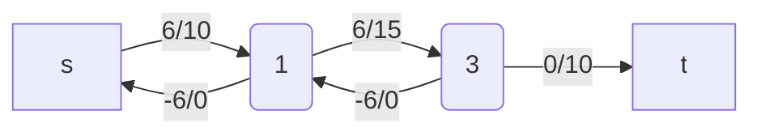

Bottleneck is 4 since the minimum of the remaining capacities on the augmenting path is 4:

```php
min(10 - 6. 15 - 6, 10 - 0) = min(4, 9, 10) = 4
```

Now, we'll augment the graph with bottleneck value of 4.

For another iteration of the Max-Flow algorithm:

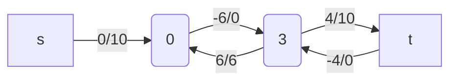

Bottleneck is 6 since the smallest remaining capacity amongst the edges of our augmenting path is:

```php
min(10 - 0, 0 - -6, 10- 4) = min(10, 6, 6) = 6
```

Now, we'll augment the graph with bottleneck value of 6.

For another iteration of Max-Flow algorithm:

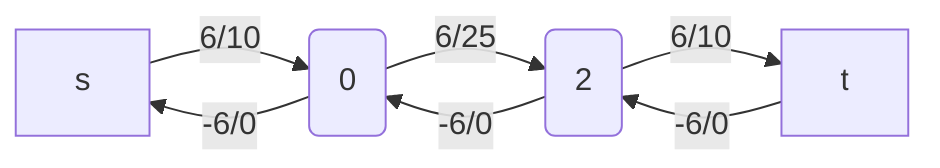

Bottleneck is 4 since the smallest remaining capacity amongst the edges of our augmenting path is:

```php
min(10 - 6, 25 - 6, 10- 6) = min(4, 19, 4) = 4
```

Now, we'll augment the graph with bottleneck value of 4.

Our Flow-Graph now looks as follows:

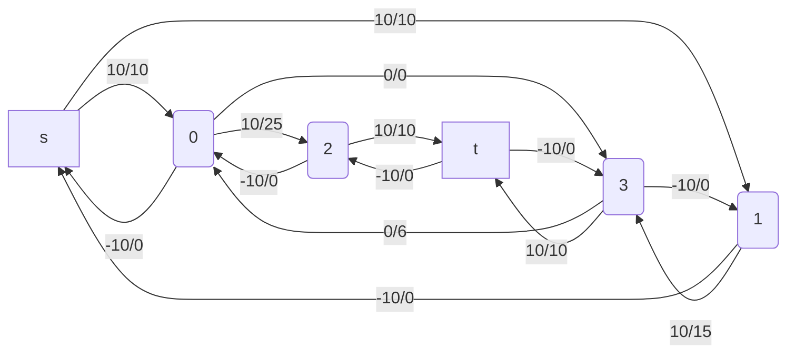

Now, no more augmenting paths can be found, so the algorithm terminates!

```php
max_flow = 6 + 4 + 6 + 4 = 20
```

#### Time Complexity

The time complexity of the Ford-Fulkerson method depends on the algorithm being used to find the augmenting paths, which is left unspecified.

Assuming the method of finding augmenting paths is by using DFS, the algorithm runs in **O(f \* E)** where `f` is the maximum flow and `E` is the number of edges.

Proof:

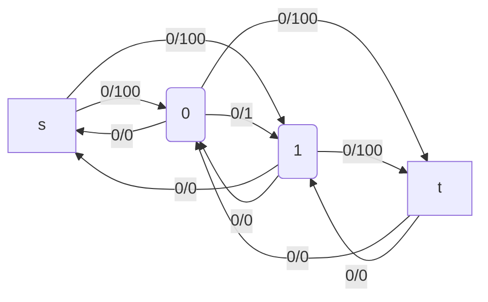

Suppose that the side-edges have very high capacity values of 100 and the middle edge has a capacity of 1.

Clearly, we can say that the maximum flow will be 200 in case of the below residual paths:

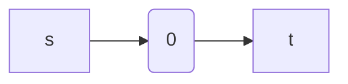

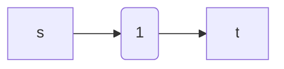

However, recall that a DFS is essentially random. Therefore, it is possible for the algorithm to take the below path every single time:

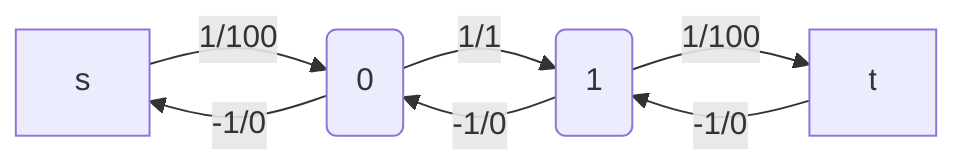

And what this will do is to limit the flow from source to the sink to be 1. Hence, 1 will be the bottleneck value and we'll never be able to augment the flow by more than one unit. This results in flipping back and forth between the same two alternating paths for 200 iterations which really kills the time complexity.

Other much faster algorithms and heruistics exist to find the maximum flow.

| Algorithm         | Description                                                                                                                                               |
| ----------------- | --------------------------------------------------------------------------------------------------------------------------------------------------------- |
| Edmonds-Karp      | Uses a BFS as a method of finding augmenting paths, `O(E^2 * V)`                                                                                          |
| Capacity Scaling  | Adds a heruistic on top of Ford-Fulkerson to pick larger paths first, `O(E^2 * log(U))`                                                                   |
| Dinic's Algorithm | Uses combination of BFS + DFS to find augmenting paths, `O(V^2 * E)`                                                                                      |
| Push Relabel      | Uses a concept of maintaining a _preflow_ instead of finding augmenting paths to achieve a max-flow solution, `O(V*2 * E)` or `O(V^2 * sqrt(E))` variant. |

**NOTE**: Be mindful that the time complexities for flow algorithms are very pessimistic (worst). In practice, they tend to operate much faster, making it hard to compare the performance of flow algorithms solely based on complexity.
